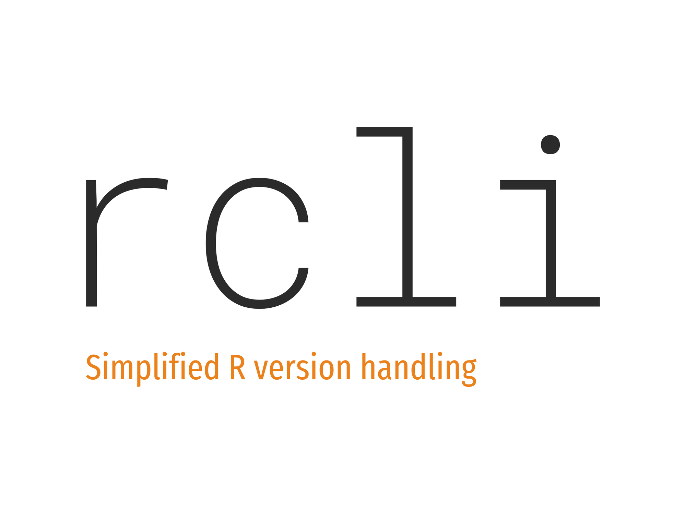

# rcli 

`rcli` is a tool for simplified installion of R versions and switching between these.
It is written in `bash`, aims to be cross-platform and low on dependencies.

See https://rcli.pat-s.me for the documentation and https://pat-s.me/announcing-rcli/ for the announcement post.
